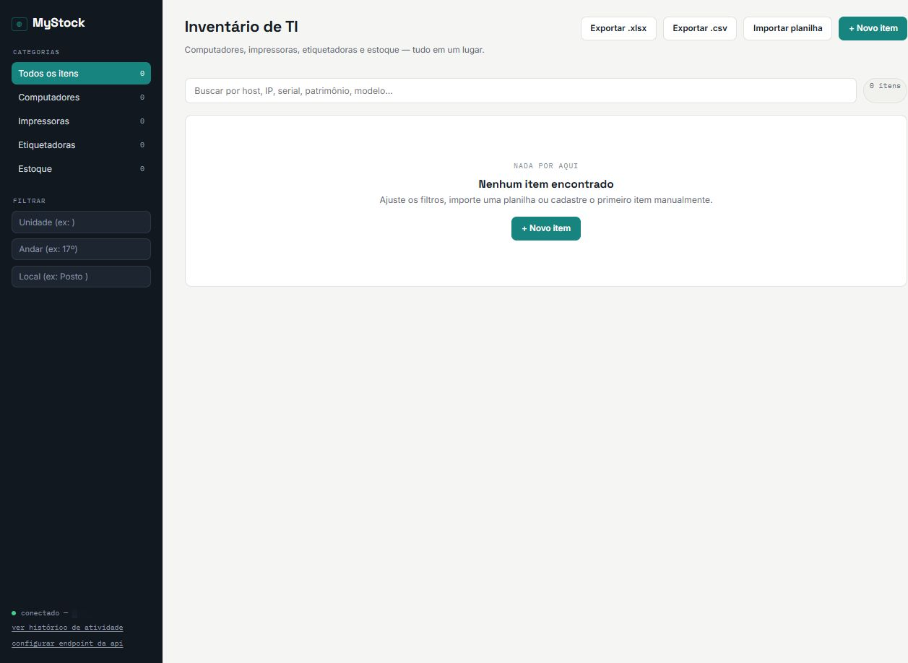
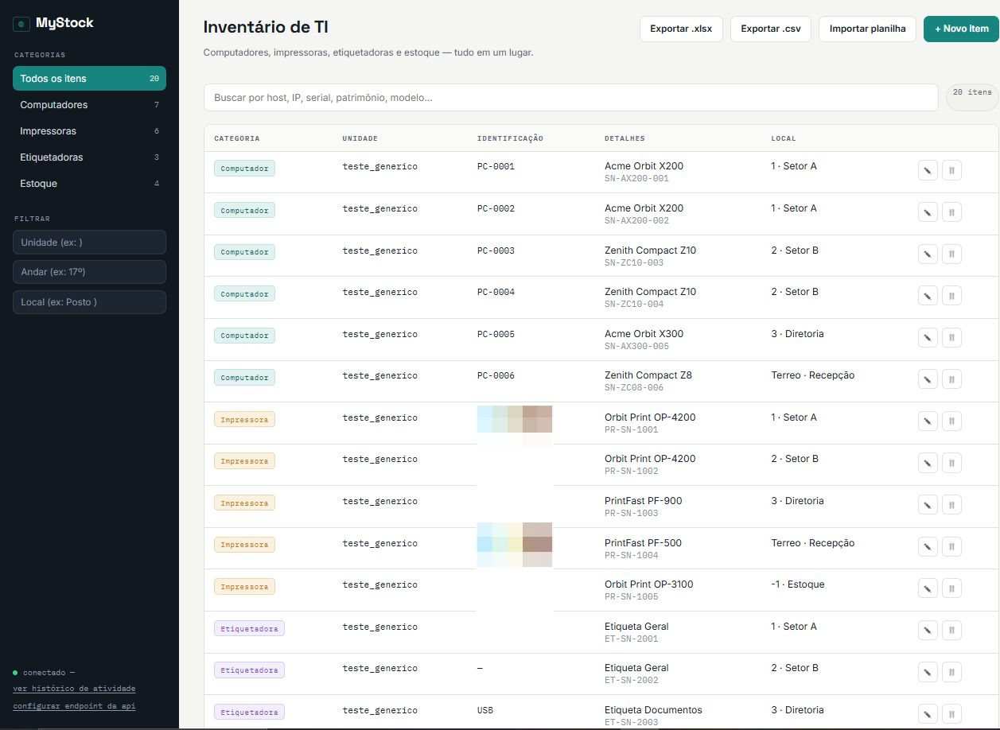
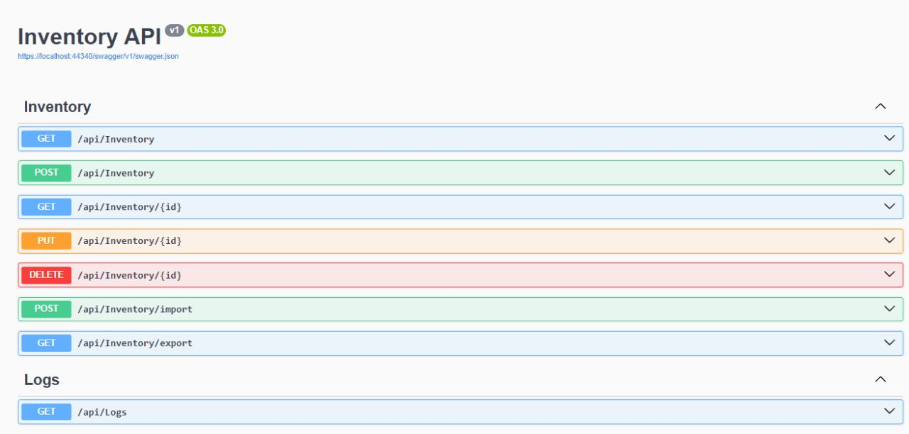

# 📊 MyStock — Inventário de TI

De planilha bagunçada a um sistema de verdade.

API integrada a um painel web para **gerenciamento de ativos de TI** (computadores, impressoras, etiquetadoras e estoque) — pensada para substituir o controle manual em planilhas por algo organizado, confiável e acessível de qualquer lugar.

## O problema

Controle de inventário de TI feito em planilha tende a virar bagunça rápido: versões desatualizadas, duplicidade de registros, formatos inconsistentes e nenhum histórico de quem mudou o quê. O MyStock nasceu pra resolver isso na prática.

## Funcionalidades

- 📥 Importação de planilhas em **Excel (.xlsx)** ou **CSV**
- 🔄 Sincronização automática de planilha atualizada, sem gerar registros duplicados
- 🕓 Histórico de todas as alterações realizadas
- 🌐 Acesso direto pelo navegador — funciona tanto em computador quanto em tablet
- 🔍 Busca por host, IP, serial ou patrimônio
- 📤 Exportação de volta para `.xlsx` ou `.csv`
- 🗂️ Organização por categoria (Computadores, Impressoras, Etiquetadoras, Estoque) e por filtros de unidade/andar/local

## Tecnologias

- **C#** / **ASP.NET Core** — API REST
- **Swagger / OpenAPI 3.0** — documentação interativa dos endpoints
- Painel web para gestão visual do inventário

## Endpoints da API

| Método | Rota | Descrição |
|---|---|---|
| `GET` | `/api/Inventory` | Lista os itens do inventário |
| `POST` | `/api/Inventory` | Cadastra um novo item |
| `GET` | `/api/Inventory/{id}` | Busca um item por ID |
| `PUT` | `/api/Inventory/{id}` | Atualiza um item existente |
| `DELETE` | `/api/Inventory/{id}` | Remove um item |
| `POST` | `/api/Inventory/import` | Importa itens em lote via planilha |
| `GET` | `/api/Inventory/export` | Exporta o inventário atual |
| `GET` | `/api/Logs` | Consulta o histórico de alterações |

## Capturas de tela

> Os dados exibidos nos prints são fictícios, criados exclusivamente para demonstração.

**Painel vazio, antes da primeira importação**

**Inventário populado, com itens de diferentes categorias**

**Documentação interativa dos endpoints (Swagger)**

## Aprendizados

Transformar a ideia de "preciso resolver um problema real" em uma ferramenta funcional trouxe desafios que só aparecem na prática: tratamento de planilhas com formatos diferentes, arquivos CSV com codificações distintas, autenticação e integração com banco de dados. Ficou claro que desenvolver software não é apenas escrever código, mas criar soluções para problemas reais — construir é sempre mais interessante do que apenas planejar.

## Contato

- LinkedIn: [Marcus Vinicius Gomes](https://www.linkedin.com/in/marcus-vinicius-gomes-226552249/)
- GitHub: [@MarcusGomesp](https://github.com/MarcusGomesp)
